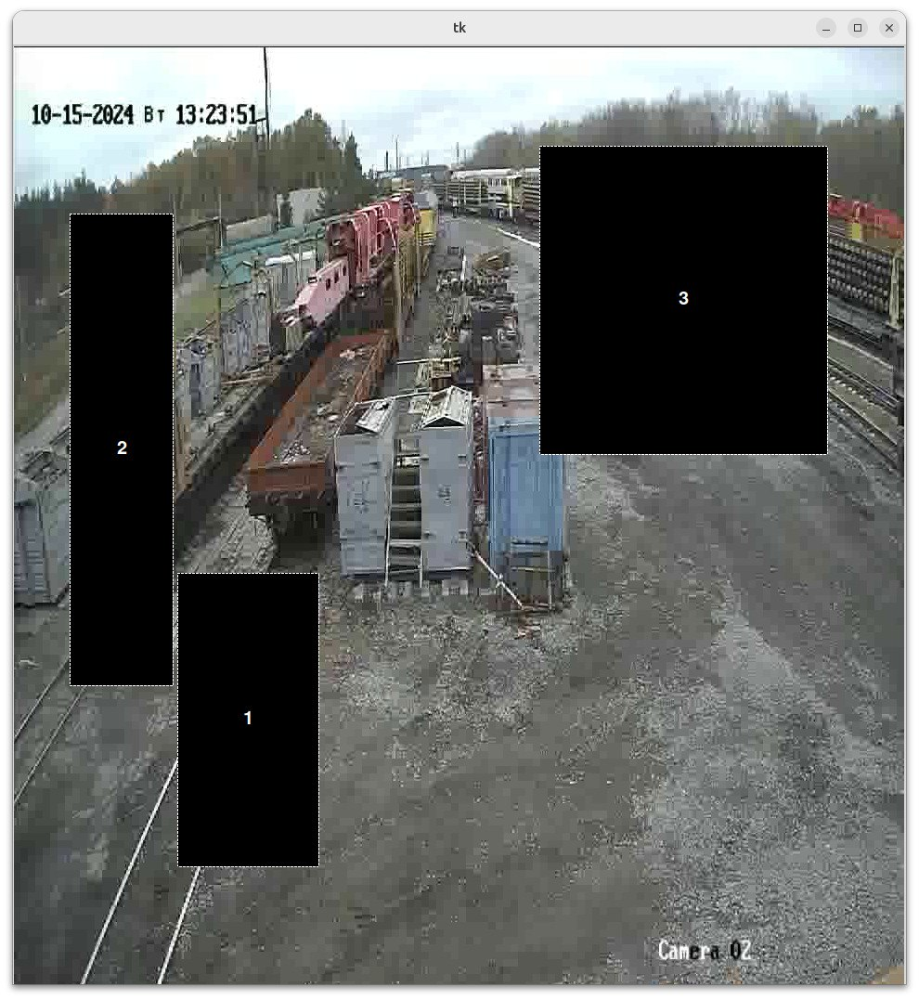
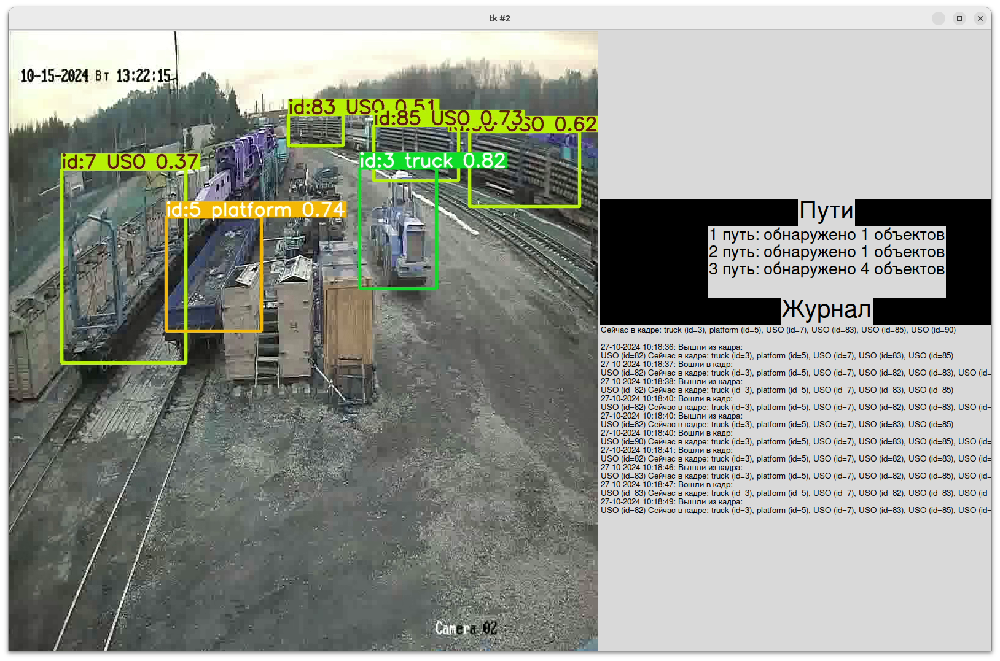

# Помощник диспетчера
## Запуск серверной части
```docker compose up```

Серверная часть включает в себя:
- базу данных MySQL (контейнер db)
- бекенд
- имитацию камеры, работающей по RTSP на localhost:8554/cam1

# Помощник диспетчера
## Запуск серверной части
``` bash
sudo apt install gir1.2-gst-rtsp-server-1.0 gstreamer1.0-plugins-good gstreamer1.0-plugins-bad gstreamer1.0-plugins-ugly libgirepository1.0-dev libcairo2-dev -y
```

docker compose up

python3 __main__.py

## Запуск клиента
``` bash
cd client
pip3 install -r requirments.txt
python3 create_tracks.py
python3 client.py
```

Серверная часть включает в себя:
- базу данных MySQL (контейнер db)
- бекенд
- имитацию камеры, работающей по RTSP на localhost:8554/cam1

# Работа программы
## Разметка путей
Для начала пользователь единожды запусает программу редактор и размечает пути, выходил и сохраняет изменения.


## Работа приложения
Далее будет основное окно приложения.
На нем показано видео с камеры, с детектируемыми на нем объектами, а также указано какие пути занят.
Ведется журнал действий. 
